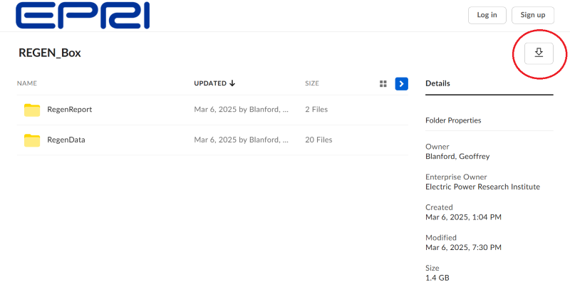
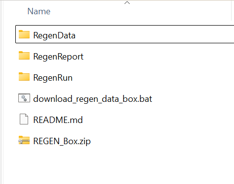

# The US **R**egional **E**conomy, **G**HG, and **En**ergy model (**US-REGEN**)

## Introduction 
This GitHub repository contains code to run EPRI's U.S. Regional Economy, Greenhouse Gas, and Energy (US-REGEN). US-REGEN is an energy-economy model developed and maintained by EPRI's [Energy System and Climate Analysis (ESCA)](https://esca.epri.com/) group. 

More information is available in the US-REGEN User's Manual in this repository and at the [US-REGEN home page](https://esca.epri.com/usregen).

Full model documentation is available [here](https://us-regen-docs.epri.com/)

## Getting Started

### Platform Requirements

The US-REGEN model is written primarily in [GAMS](https://www.gams.com). This version of US-REGEN has been tested in GAMS Version 47 with the CPLEX solver. System requirements for running US-REGEN include:  

- Valid GAMS license with CPLEX solver (or other linear programming solver)
- Minimum of 32 GB of RAM

### Installation

The GitHub repository for US-REGEN includes model code and execution scripts, stored in the RegenRun subfolder.  Input data files (stored in the RegenData and RegenReport folders) must be downloaded separately from a [public Box folder](https://epri.box.com/s/c97ncbyc7wvezs8239mjcafln9629w3g).

#### Clone Repository

To install US-REGEN, users can either download the files or clone the GitHub repository.

To clone the repository, use the command prompt in Windows and type the command `git clone https://github.com/epri-dev/XXXXXX`

To download the repository directly from the Github page, click **Code** | **Download ZIP**, then extract the downloaded zip file in the desired location.

#### Download Input Data

After cloning the model source code, users need to download the accompanying input data. Users can download this data directly, or use the batch script included in the GitHub repository to download data files into the appropriate directory locations.

##### Download input data directly

Input data can be downloaded [here](https://epri.box.com/s/c97ncbyc7wvezs8239mjcafln9629w3g). Clicking this link will open a Box folder with all the input files organized in the correct folder structure (see image below).

Click the down-arrow icon in the upper right corner to download all files and directory tree as a zip file called `REGEN_Box.zip`. Save this zip file at the root directory of the US-REGEN that you cloned. Next, extract the contents of the zip file at the root directory of the US-REGEN.

Box may create the compressed file with an additional directory at the first level called `REGEN_Box`. If this is the case, move the subfolders `RegenData` and `RegenReport` to the root directory of US-REGEN and delete the now empty folder `REGEN_Box`

If the contents were extracted correctly, the root directory of US-REGEN will then contain three subfolders, as illustrated by the image below

#####  Download input data through batch script

Instead of manually downloading the .zip file from the Box folder, users can execute the script `download_regen_data_box.bat` located at root directory of US-REGEN.

In the command prompt in Windows, navigate to the root directory of US-REGEN. Then execute the script by typing the command `call download_regen_data_box.bat`. This script will automatically download all the files and save them at the correct location in the folder structure.

### Running US-REGEN

After installation, the model can be run using the batch script RegenRun/run_elecfuels.bat.  See the US-REGEN User's Manual included in the repository for more information.

## Contacts

For more information, please contact:

Geoffrey Blanford, [gblanford@epri.com](mailto:gblanford@epri.com)
John Bistline, [jbistline@epri.com](mailto:jbistline@epri.com)
